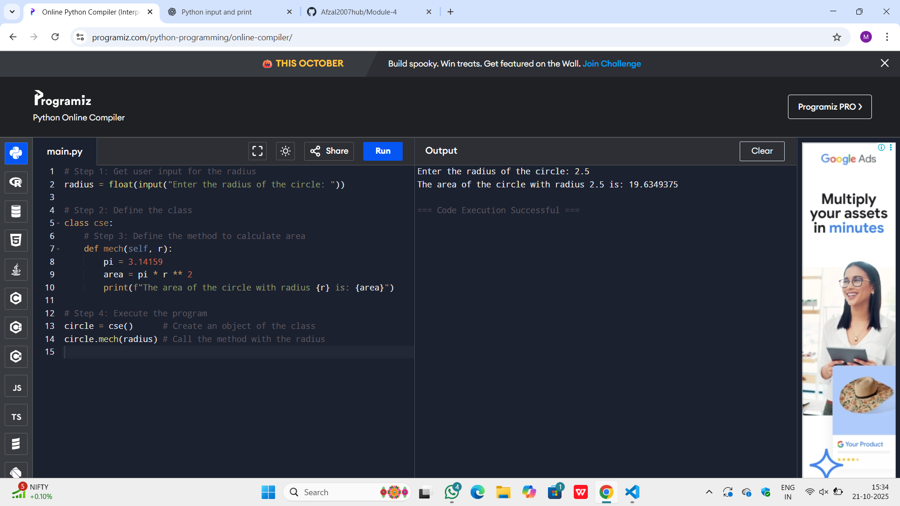
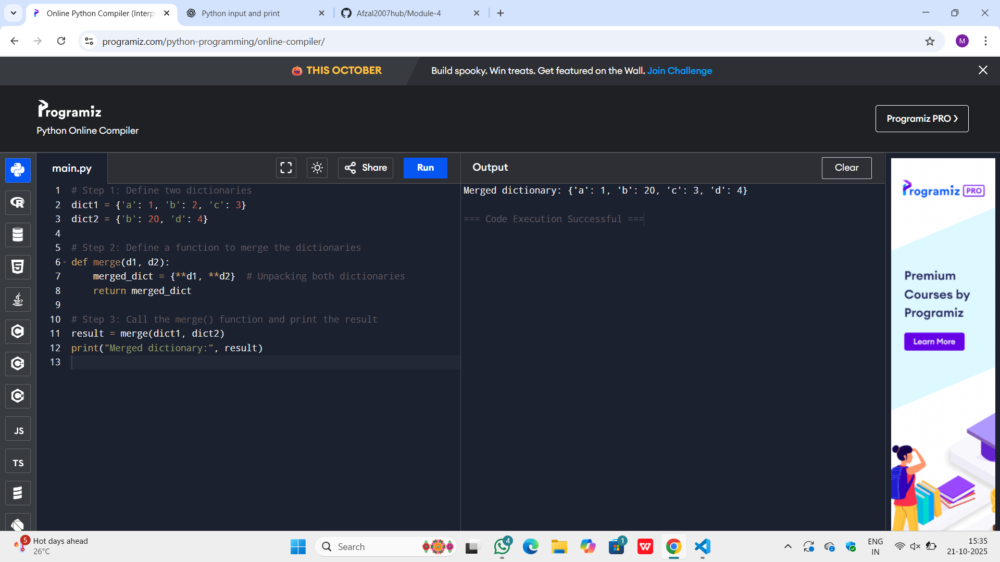
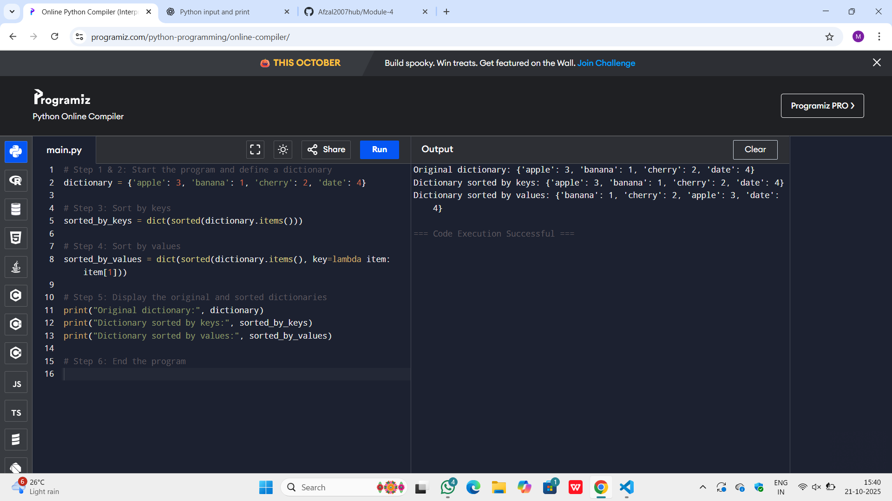
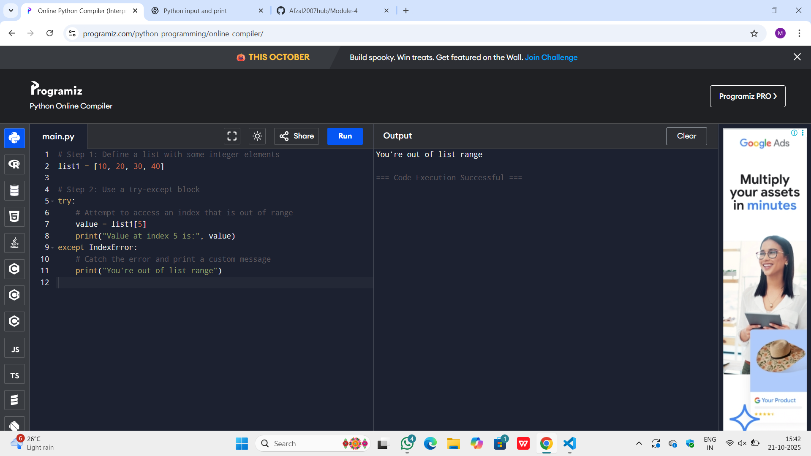
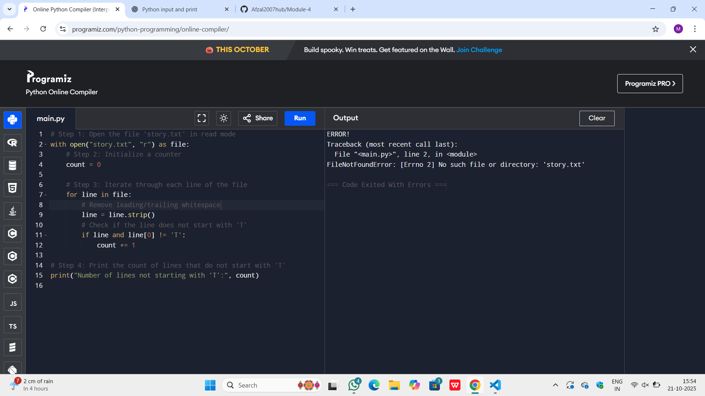

# Classes and Objects in Python: Calculate the Area of a Circle

## 🎯 Aim
To write a Python program that calculates the **area of a circle** based on the radius provided by the user. This program uses a class named `cse` and a method `mech` to perform the calculation.

## 🧠 Algorithm
1. **Get user input**: Take the radius of the circle as input from the user.
2. **Define the class**: Create a class named `cse`.
3. **Define the method**: Inside the class, define the method `mech` to calculate the area of the circle using the formula:  
   Area = pi *r^2 
4. **Execute the program**: Create an object of the class and call the method with the radius value.

## 🧾 Program
~~~
# Step 1: Get user input for the radius
radius = float(input("Enter the radius of the circle: "))

# Step 2: Define the class
class cse:
    # Step 3: Define the method to calculate area
    def mech(self, r):
        pi = 3.14159
        area = pi * r ** 2
        print(f"The area of the circle with radius {r} is: {area}")

# Step 4: Execute the program
circle = cse()      # Create an object of the class
circle.mech(radius) # Call the method with the radius

~~~
## Output

## Result
The given program is executed successfully

## Dictionary Operations in Python: Merging Two Dictionaries

## 🎯 Aim
To write a Python program that merges **two dictionaries** and combines their key-value pairs.

## 🧠 Algorithm
1. Define two dictionaries `dict1` and `dict2` with some key-value pairs.
2. Define a function `merge()` that merges the two dictionaries using the `**` unpacking operator.
   - The merged result will combine keys from both dictionaries. If a key exists in both, the value from `dict2` will overwrite that from `dict1`.
3. Call the `merge()` function and print the merged dictionary.

## 🧾 Program
~~~
# Step 1: Define two dictionaries
dict1 = {'a': 1, 'b': 2, 'c': 3}
dict2 = {'b': 20, 'd': 4}

# Step 2: Define a function to merge the dictionaries
def merge(d1, d2):
    merged_dict = {**d1, **d2}  # Unpacking both dictionaries
    return merged_dict

# Step 3: Call the merge() function and print the result
result = merge(dict1, dict2)
print("Merged dictionary:", result)
~~~

## Output

## Result
The given program is executed successfully

# 🔤 Dictionary-Python Program to Sort a Dictionary by Keys and Values

This Python program demonstrates how to sort a dictionary:
- Alphabetically by keys
- Alphabetically by values

---

## 🎯 Aim

To write a Python program that sorts a dictionary's:
- Keys in alphabetical order
- Values in alphabetical order

---

## 🧠 Algorithm

1. **Start the program.**
2. **Define** a dictionary with key-value pairs.
3. **Sort by Keys**:
   - Use `sorted(dictionary.items())`
   - Convert the result to a dictionary using `dict()`
4. **Sort by Values**:
   - Use `sorted(dictionary.items(), key=lambda item: item[1])`
   - Convert the result to a dictionary using `dict()`
5. **Display** the original and sorted dictionaries.
6. **End the program.**

---

## 🧪Program
~~~
# Step 1 & 2: Start the program and define a dictionary
dictionary = {'apple': 3, 'banana': 1, 'cherry': 2, 'date': 4}

# Step 3: Sort by keys
sorted_by_keys = dict(sorted(dictionary.items()))

# Step 4: Sort by values
sorted_by_values = dict(sorted(dictionary.items(), key=lambda item: item[1]))

# Step 5: Display the original and sorted dictionaries
print("Original dictionary:", dictionary)
print("Dictionary sorted by keys:", sorted_by_keys)
print("Dictionary sorted by values:", sorted_by_values)

~~~

## Sample Output

## Result
The given program is executed successfully

# Exception Handling in Python: Avoiding Index Errors

## 🎯 Aim
To write a Python program that handles an **IndexError** when trying to access an element beyond the available range of a list.

## 🧠 Algorithm
1. Define a list `list1` with some integer elements.
2. Use a **try-except** block:
   - In the `try` block, attempt to access an index that is out of range (e.g., `list1[5]`).
   - In the `except` block, catch the error and print a custom message `"You're out of list range"`.
3. Print the result based on whether the index access succeeds or fails.

## 🧾 Program
~~~
# Step 1: Define a list with some integer elements
list1 = [10, 20, 30, 40]

# Step 2: Use a try-except block
try:
    # Attempt to access an index that is out of range
    value = list1[5]
    print("Value at index 5 is:", value)
except IndexError:
    # Catch the error and print a custom message
    print("You're out of list range")
~~~

## Output

## Result
The given program is executed successfully

# File Handling in Python: Count Lines Not Starting with 'T'

## 🎯 Aim
To write a Python program that counts the number of lines in a text file `story.txt` that do **not** start with the alphabet `'T'`.

## 🧠 Algorithm
1. Open the file `story.txt` in **read mode**.
2. Initialize a counter `count` to zero.
3. Iterate through each line of the file:
   - Check if the first character of the line is **not** `'T'`.
   - If the line does not start with `'T'`, increment the `count` by 1.
4. After processing all lines, print the `count` value, which represents the number of lines that do not start with `'T'`.

## 🧾 Program
~~~
# Step 1: Open the file 'story.txt' in read mode
with open("story.txt", "r") as file:
    # Step 2: Initialize a counter
    count = 0
    
    # Step 3: Iterate through each line of the file
    for line in file:
        # Remove leading/trailing whitespace
        line = line.strip()
        # Check if the line does not start with 'T'
        if line and line[0] != 'T':
            count += 1

# Step 4: Print the count of lines that do not start with 'T'
print("Number of lines not starting with 'T':", count)
~~~

## Output

## Result
The given program is executed successfully
